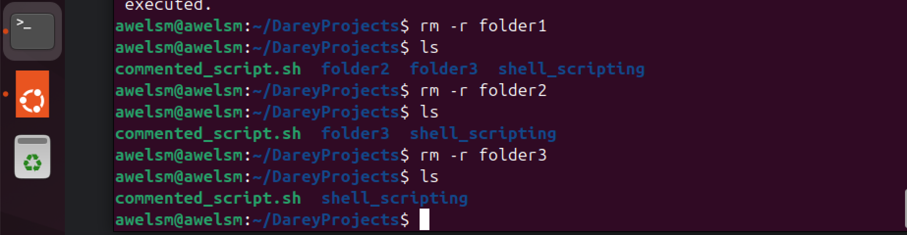

# Linux_Shell_scripting_comments
here i will be submitting my project on Linux Shell Scripting Comments

## Adding comments in a shell script. 
Comments are essential in programming, serves as notes to the programmmer and anyone else who might read the code.

Comments helps in clarity, maintainabilty, usefullness. however, it is important to avoid overcommenting. 

there is single line comment and multiple single line 

# Single line comment
the image below depicts the single line comment. 

I am going to execute the script so that the echo command can go through. the image below depicts this. 

This shows the script was successfully executed as seen that the echo confirmed it.

## DELETING THE FOLDERS AND THE USERS CREATED BY EXECUTING THE SCRIPT
I went ahead to delete all the users and the folders that i created by executing the script using these commands. 
"sudo userdel user11"
"sudo userdel user21"
"sudo userdel user31"

"sudo rm -r folder11"
"sudo rm -r folder21"
"sudo rm -r folder31"

the image below depicts these. 

# Multiple single line comment 
the image below depicts the multiple single line comments. 

this shows the multiple single line comment. I would be executing the script so that the echo command can go through.
The image below depicts this.  

 From the image above, it shows that the script was successfully executed and the echo command proves it. 

 for further comfirmation lets check the directory to see if the folders where created and the users are created. This can be done by using the command "ls" and using the command "id user11" "id user21" "id user31". The image below depicts these 

## DELETING THE FOLDERS AND USERS 
### DELETING OF THE USERS
This is done by using the command "sudo userdel user11" "sudo userdel user21" "sudo userdel user31" 

from the image below, it shows that the users that were created from executing the script have been successfully deleted. 

### DELETING OF THE FOLDERS
This is done by using the command "rm -r folder11 folder21 folder31"

the image below shows that the folders have been successfully deleted. 

## CONCLUSION

In this project, I explored the importance of comments in shell scripting, focusing particularly on single-line and multiple single-line comments. Comments, introduced with the # symbol, are essential tools used to improve clarity in a script. They serve to explain the purpose and function of different sections of code, making it easier for anyone—whether the original author or another user—to understand what the script is intended to do.

Single-line comments are placed above or beside specific commands to describe their function. Multiple single-line comments can be used consecutively to explain a complex section in greater detail. Throughout my script, I used comments effectively to describe each step, ensuring that anyone reviewing the script would find it readable and understandable.

As part of the script’s logic, I included clean-up actions to delete all folders and users created during the script’s execution, in line with the instructions provided. I also used the echo command at key points to confirm whether specific sections of the script ran successfully. Overall, this project highlighted how comments are not just decorative—they are vital for maintaining, understanding, and safely executing shell scripts.