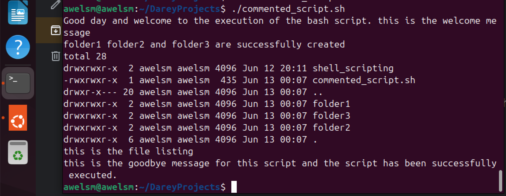
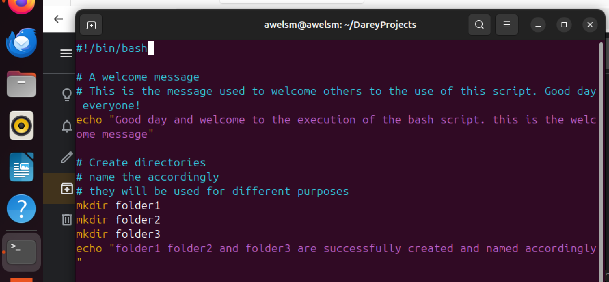

# Linux_Shell_scripting_comments

here i will be submitting my project on Linux Shell Scripting Comments. it also contains the welcome message, the goodbye message, the file listing etc. the images below shows these. 

## Adding comments in a shell script. 
Comments are essential in programming, serves as notes to the programmmer and anyone else who might read the code.

Comments helps in clarity, maintainabilty, usefulness. However, it is important to avoid overcommenting. 

There is single line comment and multiple single line 

# Brief Introduction
This project, titled Linux Shell Scripting (Comments), centers on the practical use of comments within Bash scripting. As scripting is an essential skill for managing and automating tasks in Linux-based environments, learning how to properly document scripts is just as important as writing the commands themselves. The project allowed me to work hands-on with common Bash scripting tasks while focusing on the use of comments to improve readability, maintainability, and clarity within the script.

# Purpose of the Project
The main purpose of this project is to understand and demonstrate the importance of using comments in Bash scripts—specifically single-line and multiple single-line comments. By writing a shell script that performs user and folder creation, confirms execution using the echo command, and concludes with cleanup actions, I was able to explore how comments guide both the writer and future users of the script. The project highlights how proper commenting helps explain the logic behind each action, supports easier debugging, and ensures scripts are clear and understandable, even to someone who did not originally write them.

# Single line comment
the image below depicts the single line comment. It contains the creation of the bash script called "commented_script.sh". 

After the creation of the bash script, i went ahead to write the single line comments, the welcome message and the goodbye messages, i wrote the command for the creation of the directories and the listing of files and the printing of messages. the image below depicts this 

The images above shows the use of single line comment. 
This serves as the guide to the user and the future users of the script. it explains the logic behind every action. The echo command also helps in notifying the user and the future users that the script has been executed successfully. 

# Execution of the script. 
The image below shows the execution of the script and it was successfull. the echo command proves this. 

Permission was denied at first but i ran the "chmod +x" command and i was able to execute the script. The echo command also confirms it. 

## DELETING THE FOlDERS OR FILES

I went ahead to delete all the users and the folders that i created while executing the script using these commands. 

"sudo rm -r folder11"
"sudo rm -r folder21"
"sudo rm -r folder31"

the image below depicts these. 

# Multiple single line comment 
the image below depicts the multiple single line comments. 

most times multiple single line comment is used to clarify and explain more. however, it is important to note that overcommenting is not good this is because 
1. it clutters the script
2. it makes maintenance harder
3. it slows down understanding
4. it can hide poor code
5. it makes script lonher than necessary

So, What’s the Ideal Approach?
	•	Comment only when it adds value.
	•	Use comments to explain why, not what, when the code itself is clear.
	•	Use comments to mark sections or explain logic, not to describe every command.
	•	Keep comments short, relevant, and up-to-date.

In summary, over-commenting distracts from the actual logic of the script, reduces readability, and can even lead to confusion. Effective scripting is all about balance—write just enough comments to make the code understandable, but let the code speak for itself wherever possible.

The image below depicts the use of multiple single line comment.

the image below shows that the bash script has been successfully created. 

# DELETING THE FILES OR FOLDERS CREATED
This is done by using the command "rm -r folder1 folder2 folder3"
the image below depicts this

the image shows that the files have been deleted because clean up is important after running a project. 

Cleanup is important because it:
1. Keeps the system tidy
2. Avoids security and performance issues
3. Allows smooth re-runs
4. Prevents confusion
5. Reflects professionalism

In scripting, finishing well is just as important as starting right—and cleanup is how you finish well.

 

## CONCLUSION
This project gave me a practical opportunity to understand and apply the use of comments in Bash scripting. I successfully carried out several tasks including:
1. Writing and executing a shell script
2. Creating users and folders
3. Adding single-line and multiple single-line comments to explain actions clearly
4. Using the echo command to verify script execution
5. Cleaning up by deleting all created users and folders—showing discipline beyond what was required

Through this, I learned how comments enhance script readability, guide users through the logic of the code, and support future maintenance. Above all, this project taught me that while commenting is essential, clarity must never be compromised by over-commenting. Clean, well-commented scripts are the mark of a responsible and forward-thinking developer